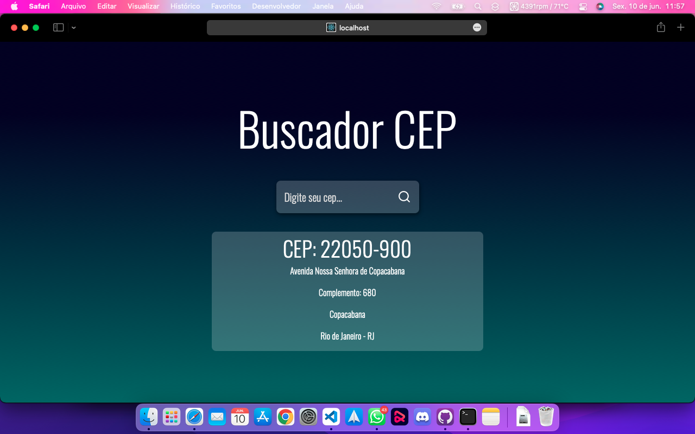

<h1 style="text-align: center; font-weight: 500; font-size: 38px">Buscador de CEP</h1>

Eu fiz esse buscador de cep para aprimorar as minhas habilidades em ReactJS. Utilizei a api do <a href="http://viacep.com.br">ViaCep</a> para a consulta dos CEP.

<h1>Imagem do projeto</h1>

<h1>Como rodar</h1>

Clone o reopistório, execute o comando: <code>npm install</code>, após isso, rode o <code>npm start</code>. O site vai abrir no <code>localhost:3000</code> automaticamente no seu browser padrão.
